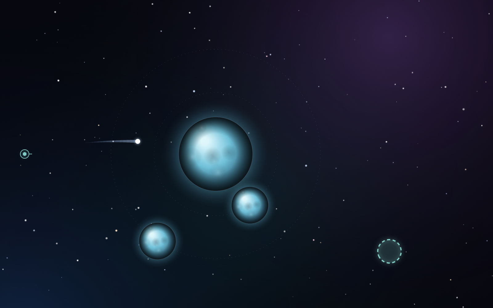

# Apogee

[](https://github.com/kcselm/apogee/actions/workflows/ci.yml)

Apogee — a space-curling puzzle. **[Play →](https://apogee-7w9.pages.dev)**



## How it plays

- **Drag anywhere to aim, release to launch.** The pull is the shot; a dashed preview shows where it goes.
- **Gravity does the rest.** Planets bend the flight, red worlds destroy anything that touches them, moons move on a fixed clock, wormholes teleport.
- **Land in the rings or clear the objective.** Daily: five launches, score by where they stop. Campaign: thirty authored levels across ten chapters, each with a par and three stars to earn.

## Why the engine is interesting

The simulation is a pure, dependency-free TypeScript package that produces the same result on every machine.

- **Determinism by construction.** The simulation loop uses only `+ − × ÷ sqrt`, the operations IEEE 754 pins down exactly, so there is no trig or transcendental drift between engines. Same seed and same inputs give an identical trajectory everywhere.
- **Seeded generation.** The daily board is generated from the date; everyone plays the same star system.
- **Golden tests.** Full daily and campaign runs are locked in end-state snapshots; a golden that changes is a bug, never a regeneration.
- **Brute-force solvability.** Every static campaign level is proven solvable within its launch budget by brute-force search over a launch grid on each test run.
- **Mechanic audits.** Opt-in tools delete a level's moons or wormholes and re-solve it to prove the mechanic was required, discover pars, and find stored solutions for the moving levels.
- **Replayable inputs.** A launch is a direction pair and an optional tick; a whole run is a seed plus a handful of them, small enough to verify a replay anywhere.

## Develop

```sh
pnpm install
pnpm dev          # the game, packages/web
pnpm test         # engine + web suites
pnpm typecheck
```

Deploying is one command after a green `main` (the site is a Cloudflare Pages direct-upload project; CI gates, it does not deploy):

```sh
pnpm --filter @apogee/web build && npx wrangler pages deploy packages/web/dist --project-name apogee --branch main
```

The solver-backed tools are gated behind `SOLVE=1` because they run for seconds to minutes:

```sh
SOLVE=1 pnpm --filter @apogee/engine exec vitest run ablation-audit       # mechanic required?
SOLVE=1 pnpm --filter @apogee/engine exec vitest run discover-pars        # par per static level
SOLVE=1 pnpm --filter @apogee/engine exec vitest run discover-solutions   # stored solutions for moving levels
```

On PowerShell: `$env:SOLVE=1; pnpm --filter @apogee/engine exec vitest run ablation-audit; Remove-Item Env:SOLVE`.

## Architecture

- `packages/engine` — pure, deterministic simulation. Zero dependencies. Only `+ − × ÷ sqrt` in numeric code. Same seed + same inputs → identical outcome, everywhere.
- `packages/web` — React + Vite + canvas renderer. Calls the engine, draws the results, computes no physics itself.

Design docs and plans live in [`docs/superpowers/`](docs/superpowers/); the current roadmap is [`docs/superpowers/specs/2026-09-01-apogee-polish-roadmap.md`](docs/superpowers/specs/2026-09-01-apogee-polish-roadmap.md).

## License

[MIT](LICENSE)
